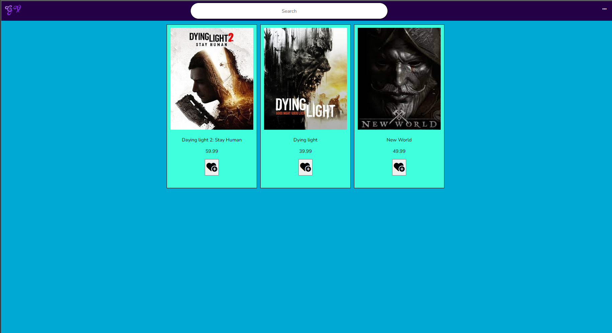

## Trabajo Recomandador de juegos, con las paginas con el menor Precio de compra.

para que fuciona el projecto, tienes que crear una Base de Datos en xampp con el nombre gamevendor y ejecutar el script(Esta en la carpeta principal del projecto) dendro de la Base de datos.
luego solo tienes que tener un usuario de nombre root y sin contraseña.
El puerto utilizdado para conectar a la base de datos es 3306 y el puerto para conectar atravez el navegador es 9090.

[Si esta hecho todo y el projecto ejecutado](http://localhost:9000/)

**Explicacion de la Pagina**

La pagina trata de videojuagos de todo tipo y con toda su information, se puede hacer reviews de cada videojuego y se puede anyadir cada videojuego a su propia lista favoritos (despues de crear una cuenta de usuario).
La pagina tambien tiene un registro y un login. Despues del login el usuario puede ver su cuenta y su lista favoritos.

Todos los datos de la pagina son de la base de datos.

Login para el usuario:

Registrar para usuarios nuevos:

Index con los juegos:

Base de datos con las tablas necesarias al principio.

